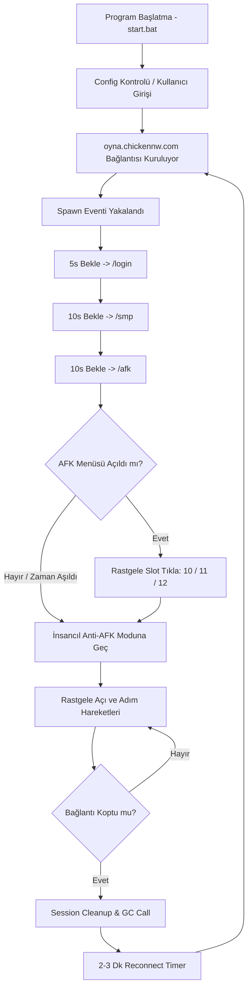

# 🐔 Chicken Network Server AFK Bot (FindLoader v1.0)

<div align="center">


</div>

<p align="center">
  <b>Chicken Network (oyna.chickennw.com)</b> sunucusu için özel olarak geliştirilmiş, %100 RAM sızıntısı engellenmiş (Zero-RAM-Leak), insancıl hareket simülasyonuna sahip, yüksek performanslı ve tam otomatik <b>Minecraft AFK Botu</b>.
</p>

---

## ⚡ Öne Çıkan Özellikler (Why FindLoader?)

```
 ╔═════════════════════════════════════════════════════════════════════╗
 ║                  CHICKEN NETWORK SERVER AFK BOT                     ║
 ║                                                                     ║
 ║  • %0 RAM Sızıntısı (Strict Session & GC Garbage Collector Isolation║
 ║  • Otomatik /login, /smp, /afk ve GUI Menü Tıklama Sistemi          ║
 ║  • İnsancıl Anti-AFK (Rastgele Bakış Açısı ve İleri/Geri Adımlar)   ║
 ║  • Akıllı Sunucu Yeniden Bağlanma (Auto-Reconnect & Backoff)        ║
 ║  • Interaktif CLI Terminal Chat & Canlı Sohbet Gizleme (!kapa/!aç)  ║
 ╚═════════════════════════════════════════════════════════════════════╝
```

---

## 🛡️ RAM Sızıntısı Garantisi (Zero Memory Leak Engine)

Sıradan Minecraft botları günlerce veya haftalarca açık kaldığında Node.js belleğinde (RAM) şişme yapar, event listener birikintileri oluşturur ve en sonunda çöker. **Chicken Network AFK Bot**, bu sorunu kökten çözmek için özel mimari mekanizmalar barındırır:

1. **Strict Session Isolation (Oturum İzolasyonu):** Bot sunucuya her bağlandığında yeni ve benzersiz bir `sessionId` ile izole bir oturum nesnesi oluşturulur.
2. **Derinlemesine Socket & Event Cleanup:** Bağlantı koptuğunda veya oturum sonlandığında TCP socket (`client.socket.destroy()`), protokol istemcisi ve tüm bot event listener'ları silinir.
3. **Ağır Nesne Sıfırlama:** Botun `entities`, `players`, `world`, `inventory` gibi yüksek RAM tüketen nesneleri açıkça `null` durumuna getirilir.
4. **Zorlamalı Garbage Collection (`--expose-gc`):** Her konsol temizliğinde (15 dakikada bir) ve oturum değişiminde `global.gc()` çağrılarak V8 motorundaki çöp bellek anında serbest bırakılır.
5. **AbortController Asenkron Bekleme İptali:** `sleep` zamanlayıcıları oturum kapandığı anda `AbortSignal` ile anında iptal edilir, arka planda asılı kalan timer bırakmaz.

---

## 🌟 Ana Özellikler & Fonksiyonlar

### 🤖 1. Tam Otomatik Oturum ve Giriş Akışı
- **Otomatik Komut Zinciri:** Sunucuya katıldıktan sonra sırasıyla belirlenen gecikmelerle:
  1. ⏳ **5 saniye sonra:** `/login <şifre>`
  2. ⏳ **10 saniye sonra:** `/smp`
  3. ⏳ **10 saniye sonra:** `/afk`
- **Akıllı AFK GUI Menü Tıklaması:** `/afk` gönderildiğinde açılan envanter penceresini (`windowOpen`) algılar ve rastgele **10, 11 veya 12** numaralı slota otomatik tıklar. Menü açılmazsa zaman aşımına uğramadan doğrudan Anti-AFK moduna geçer.

### 🎭 2. İnsancıl Anti-AFK Algoritması (Anti-Ban Guarantee)
Sunucu bot koruma sistemlerini (Anti-AFK Plugin) atlatmak için tamamen rastgele ve insansı hareketler sergiler:
- **Dinamik Zamanlama:** Hareketler her **2 ile 3 dakika** arasında rastgele seçilen zamanlarda tetiklenir.
- **Gerçekçi Bakış Açısı Dönüşü (`look`):** Karakter sağa veya sola `0.3` ila `1.2` radyan arasında rastgele açısal dönüş yapar.
- **Kısa Yürüyüş Adımları:** `300ms` - `800ms` aralığında milisaniyelik ileri/geri mikro yürüyüş adımları atar.

### 🔄 3. Kesintisiz Reconnect & Sunucu Bakım Toleransı
- Sunucu kapandığında veya bakıma girdiğinde bot kopma sebebini analiz eder.
- Sunucunun yeniden başlamasına zaman tanımak amacıyla **2 ila 3 dakika** arasında rastgele bekleme süresi hesaplayarak otomatik yeniden bağlanır.
- Deneme sayılarını ekranda canlı olarak raporlar (`Deneme: X`).

### 💬 4. Konsol & İnteraktif Chat Kontrolü
- **Canlı Sohbet:** Terminale yazdığınız her metin doğrudan Minecraft sunucusuna chat mesajı veya komut olarak gönderilir.
- **Sohbet Gizleme / Açma:**
  - `!kapa` veya `!kapat`: Sunucu sohbet akışını ekranda gizler (konsolu temiz tutar).
  - `!aç` veya `!ac`: Sunucu sohbet akışını tekrar canlı gösterir.
- **Otomatik Konsol Temizliği:** Her 15 dakikada bir ANSI Escape kodları ile konsolu temizler, durumu raporlar ve bellek boşaltır.

### 🔐 5. Güvenli Config & Şifre Maskeleme
- Kullanıcı adı ve şifreniz varsayılan olarak Windows `%APPDATA%\FindLoader\config.json` yoluna güvenli şekilde kaydedilir.
- Şifre girerken ekrana yıldız (`***`) basılarak şifrenizin görünmesi engellenir.

---

## 🛠️ Mimari ve Çalışma Mantığı (Workflow)



---

## 💻 Kurulum ve Çalıştırma

### Gereksinimler
- **Node.js** (v16 veya daha yüksek bir sürüm)
- **Windows / Linux / macOS** (Windows için hazır `start.bat` mevcuttur)

### Adım Adım Kurulum

1. **Bağımlılıkları Yükleyin:**
   Proje dizininde gerekli paketleri yüklemek için terminale yazın:
   ```bash
   npm install mineflayer
   ```

2. **Botu Çalıştırın (Önerilen - Windows):**
   Proje kök dizinindeki `start.bat` dosyasını çift tıklayarak çalıştırın:
   ```cmd
   start.bat
   ```
   *`start.bat` içeriği `--expose-gc` bayrağını otomatik aktif eder ve olası çökmelerde botu 5 saniye içinde yeniden başlatacak bir döngüye sahiptir.*

3. **Terminallerden Manuel Çalıştırma:**
   ```bash
   node --expose-gc src/index.js
   ```

---

## ⚙️ Yapılandırma Dosyası (Config)

Giriş bilgileriniz bilgisayarınızda otomatik oluşturulan şu dizinde saklanır:
- **Windows:** `%APPDATA%\FindLoader\config.json`

Dosya Yapısı:
```json
{
  "kullaniciAdi": "OyuncuAdi",
  "sifre": "GizliSifreniz123"
}
```
*Giriş bilgilerinizi sıfırlamak isterseniz bu dosyayı silmeniz yeterlidir. Bot yeniden başlatıldığında bilgileri tekrar soracaktır.*

---

## ⌨️ Konsol Komutları Reference

| Komut | Açıklama |
| :--- | :--- |
| `!kapa` / `!kapat` | Sunucudan gelen oyun içi sohbet mesajlarını konsolda gizler. |
| `!aç` / `!ac` | Sunucu sohbet mesajlarını konsolda tekrar gösterir. |
| `<herhangi bir metin>` | Doğrudan oyundaki sohbet alanına mesaj veya `/komut` olarak gönderilir. |
| `Ctrl + C` | Botu ve tüm bağlantıları güvenli bir şekilde kapatır. |

---

## 📁 Proje Dosya Yapısı

```
chickennwafk/
├── 📄 README.md          # Detaylı Proje Dokümantasyonu (Bu dosya)
├── 📜 start.bat          # Auto-Restart & Garbage Collector Destekli Başlatıcı
└── 📁 src/
    └── 📄 index.js       # Ana Bot Motoru, Session Yönetimi & Anti-AFK Sistemi
```

---

## 🔧 Gelişmiş Özellik Parametreleri (`src/index.js`)

| Parametre | Değer | Açıklama |
| :--- | :--- | :--- |
| `SABIT_SUNUCU_IP` | `oyna.chickennw.com` | Hedef Chicken Network sunucusu |
| `LOGIN_ONCESI_BEKLEME_MS` | `5000ms` (5s) | `/login` öncesi bekleme |
| `SMP_ONCESI_BEKLEME_MS` | `10000ms` (10s) | `/smp` öncesi bekleme |
| `AFK_ONCESI_BEKLEME_MS` | `10000ms` (10s) | `/afk` öncesi bekleme |
| `AFK_SLOTLAR` | `[10, 11, 12]` | AFK menüsünde tıklanacak slotlar |
| `ANTI_AFK_MIN_MS` / `MAX_MS` | `2 - 3 Dakika` | Anti-AFK hareket aralığı |
| `RECONNECT_MIN_MS` / `MAX_MS` | `2 - 3 Dakika` | Reconnect beklenilen süre |
| `CONSOLE_CLEAR_MS` | `15 Dakika` | Konsol temizleme ve GC süresi |

---

<div align="center">

<b>Chicken Network AFK Bot</b> • Developed with ❤️ & High Performance Standards

</div>
